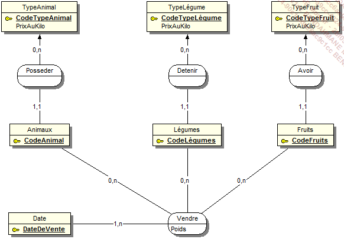
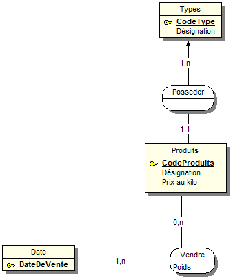
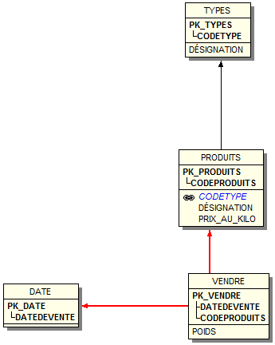

# Solution

## MCD

Voici un premier modèle conceptuel des données, qui pourrait être réalisé. Attention ce modèle présente des imperfections structurelles qui vont pénaliser la performance, la maintenance et l’intégrité de l’applicatif.

voici un modele plus coherent:

## MLD

## Model Relationnel

Types(Codetype, Désignation)

Produits(CodeProduits, Désignation, Prix_au_kilo, #Codetype)

Date(DateDeVente)

Vendre(#CodeProduits, #DateDeVente, Poids)
