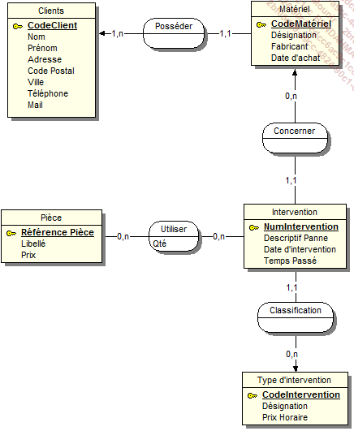
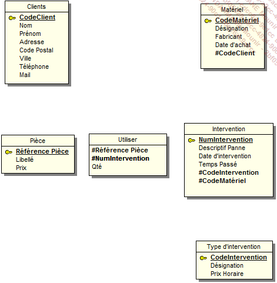
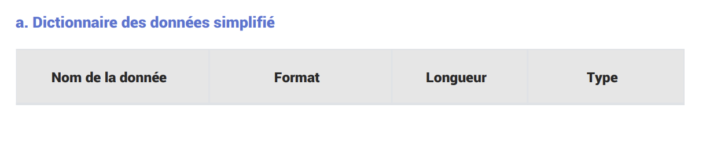
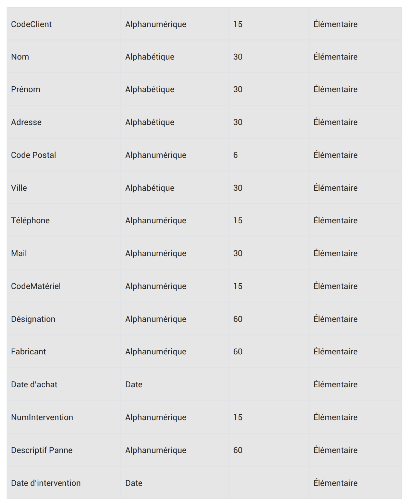

# Solution

## MCD

## MLD

## MPD

Clients(CodeClient, Nom, Prénom, Adresse, Code Postal, Ville, Téléphone, Mail)

Matériel(CodeMatériel, Désignation, Fabriquant, Date d’achat, #CodeClient)

Pièce(Référence Pièce, Libellé, Prix)

Utiliser(#Référence Pièce, #NumIntervention, Qté)

Intervention(NumIntervention, Descriptif Panne, Date d’intervention, Temps Passé, #CodeIntervention, #CodeMatériel)

Type d’intervention(CodeIntervention, Désignation, Prix Horaire)

## Dictionnaire de donnees

