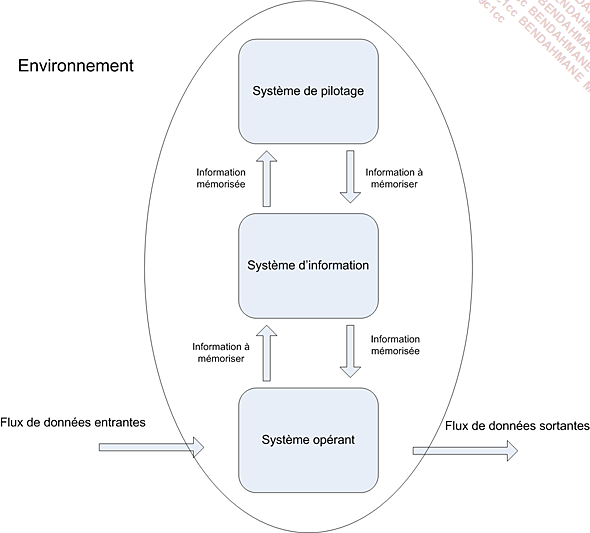

  
# Prises de notes

  

- La prise de note sera noté

- La prise de note est demande en MarkDown

- Dépot Git Local autorisé

Un dépot public du cours existe : 
```Shell
git clone https://github.com/bendahmanem/ISITECH-2223-B1-MDD.git
```

## MarkDown

  

- Un "#" permet de créer un titre 1, "##" un titre 2, ect.

- "-" Permet de créer un élément de liste
- On utilise la forme ` **exemple** ` pour avoir du texte en **gras**
- On utilise la forme ` __exemple__ ` pour avoir du texte en __italique__
- On utilise la forme `~~exemple~~` pour avoir du texte ~~barré~~


On peut créer des blocs de code en alignant 3 backticks  (ouverture puis fermeture)

```Python
print('Hello World!')
```

 
  On peut préciser la nature du code après les trois backticks d'ouverture
  
  

## Git

  

Pour check l'état du git actuel

  

```sh

git status

```

  

- Pour ajouter des fichiers non suivs :

  

```sh

git add .

```

  

Pour sauvegarder :

  

- Se placer à la racine du dépot Git

  

```sh

git commit -m "message du commint

```

  
  
  


# La Méthode Meurise

  

Cette méthode se caracterise par trois points clés :

- Une approche dite systemique : on transforme les processus de l'entreprise en système d'information

- Une séparation des données et des traitements

- Une approche nivelée

  

## L'approche systemique

  



  
  

Le systeme de pilotage :

- Il est compseé de l'ensemble des acteurs qui vont **piloter** le systeme d'information

  

Le systeme d'information :

- Il est composé de l'ensemble des acteurs qui vont **utiliser** le systeme d'information

  

Le systeme operant :

- Il est composé de l'esemble sdes acteurs qui vont **produire** les données du systeme d'information

  
  

## La séparation des données et des traitements

  

La séparation des données et des traitements permet de séparer les données du systeme d'information et

les traitements effectues sur ces données.

Cette demarche se fait en 3 étapes :

- L'analyse des flux : on analyse les flux d'informations etre les acteurs du systeme d'information et les acteurs du systeme operant

- L'étude des documents interne (factures, bon de livraison,...)

  


.... NOTES MANQUANTES A RECUP ... 


### L'approche nivelée

Pour effectuer la conception d'un SI, on va utiliser une approche nivelée. Cette approche se compose de 4 niveaux : 

- Le niveau conceptuel
- Le niveau organisationnel
- Le niveau logique 
- Le niveau physique

#### Le niveau conceptuel

Le niveau conceptuel permet de modéliser les données de l'entreprise. On va utiliser le modèle conceptuel de données (MCD) pour modéliser les données de l'entreprise, et le MCT pour modéliser les traitements effectués sur ces données

#### Le niveau organisationnel

Le niveau organisationnel va permettre d'intégrer a l'analyse précédente toutes les notions de temporalité, de chronologie des opérations, de contraintes géographiques. On va utiliser le modèle organisationnel des traitements et le modèle organisationnel des données (MOD) (MOT) pour modéliser les traitements de l'entreprise.

En résumé on se pose les questions suivante à partir des données recueillies au niveau conceptuel : 

- **Quand** les traitements sont-ils effectues ? 
- **Où** les traitements sont-ils effectués ? 
- Par **qui** les traitements sont-ils effectués ? 

#### Le niveau logique

Le niveau logique va permettre de modéliser les données de l'entrepise en utilisant le modèle logique de données (MLD) et les traitements de l'entreprise en utilisant le modèle logique des traitements (MLT)

Le MLD est indépendant des langages de programmation et des SGBD.

On répond à la question : **Avec quoi** mes traitemnts sont-ils effectues ? 

#### Le niveau physique
Il s'agit de l'organisation `réelle` des données. On va utiliser le modèle physique de données (MPD) et le modèle physique des traitements (MPT).

Ici, on apporte les olutions techniques de stockage des données et de traitement des données.

On réponds à la question : **Comment** mes traitements sont-ils effectués ?

#### Résumé : les 4 niveaux de Merise

![[Pasted image 20230717120512.png]]


### Des données aux dépendances fonctionnelles

Pour être intégrées dans uns système d'information, les données doivent être triées et organisées. On va souvent tenter de les classer par type de données : 

- Chaînes de caractères, format texte
- Type alphanumérique, format texte
- Type numérique (integer, float,...)
- Type date (date, datetime, timestamp)
- Type logique ou booléen (True, False)

Creation d'un dictionnaire de données

| Nom de la donnée | Format | Longueur | Type (Elementaire / Calculé) | Règle de calcul | Règle de gestion | Document |
| --- | --- | --- | --- | --- | --- | --- |
| Nom complet | Integer | 60 | Calculé | Concat | |Fiche|
| Adresse complet | alphanum | 200 | Calculé| Concat ||Fiche|
| Date adhésion | date | 255 |Elementaire |Aucune||Fiche|

## Les dépendances fonctionnelles

Une dépendance fonctionnelle est une relation entre deux attributs d'une table. Elle permet de définir une relation de dépendance entre deux attributs d'une table.

Le role d'une dépendance fonctionnelle est de permettre de définir une relation de dépendance entre deux attributs d'une table : une donnée A dépends fonctionnellement d'une donnée B lorsque la valeur de B Détermine la valeur de A.

Pour formaliser une dépendance fonctionnelle on utilise la notation suivante :
	 `Numero adherent (Nom, prenom, code postal, ville, telephone, date d'adhesion, mail)`

La partie gauche (numéro adherent) est la `source` de la dépendance fonctionnelle.
La partie droite désigne le `but` de la dépendance.

### Les dépendances fonctionnelles composées

Si une dépendance fonctionnelle qui fait intervenir plus de deux attributs on parle de dépendance fonctionnelle composée.

Exemple : Pour connaitre le temps d'un coureur sur une étape donnée il nous faut son numéro ou son nom ainsi que le nom ou le numéro de l'étape.

Formalisation :
`(numero coureur, numero etape) (temps)`

### Les dépendances fonctionnelles élémentaires

Une dépendance fonctionnelle A->B est élémentaire s'il n'existe pas  une donnée C, sous-ensemble de A, décrivant une dépendance fonctionnelle type C->B.

Exemples :
- RefProduit -> LibelleProduit
- NumCommande RefProduit -> QuantiteCommande
- <strike>NumCommande RefProduit -> DesignationProduit</strike> car une relation élémentaire RefProduit -> DesignationProduit existe déjà

### Dépendance fonctionnelle élémentaire directe
"On dit que la dépendance fonctionnelle A -> B est directe s'il n'existe aucune attribut C tel que l'on puisse avoir A -> C et C -> B. En d'autres termes, cela signifie que la dépendance fonctionnelle entre A et B ne peut pas être obtenue par transitivité."

Exemple :

	-RefPromo -> NumApprenant
	-NumApprenant -> NomApprenant
	-RefPromo -> NomApprenant :  RefPromo -> NumApprenant -> NomApprenant 


### Sujet TP/TD MCD jour 1

![[image-14.png]]

![[image-5 1.png]]
![[image-6 1.png]]

![[image-7 1.png]]


Le but de l'exercice est d'élaborer un MCD à partir d'un dictionnaire de données.

Ici on va introduire les notions d'entité, de relations et de propriétés.

**Les propriétés sont les informations de bases d'un SI. 

#### Les entités sont les objets de SI.

![[Pasted image 20230717151605.png]]

Quelques définitions :
	- Entité forte : une entité qui ne dépend pas d'une autre entité pour exister.
	- Entité faible : une entité qui dépend d'une autre entité pour exister.


## Les relations

![[Pasted image 20230717151715.png]]

**Les cardinalités** : elles permettent de définir le nombre d'occurrences d'une entité par rapport à une autre entité dans le cadre d'une relation. 

![[Pasted image 20230717151735.png]]

Petit Exemple : 
![[Pasted image 20230717151816.png]]
![[Pasted image 20230717151847.png]]![[Pasted image 20230717151910.png]]


#### Les relations "porteuses"

Une relation est dite porteuse si elle possède des propriétés.

image-15
image-16

#### Les relations reflexives

Une relation est dite reflexive si elle relie une entité à elle meme 

image-17

#### Les contraintes d'intégrité fonctionnelle (CIF)

Définition : Une CIF est définie par le fait qu'une des entités de l'association est complément déterminée par la connaissance d'une ou de plusieurs entités participant à l'association.

Exemple : 

![[image-18.png]]

Une salle peut contenir 0 ou plusieurs ordinateurs.  Un ordinateur existe dans une et une seule salle.
Dans type de relation une CIF existe si on a une cardinalité 1,1.

## Modèle Logique des données (MLD)

Le MLD est la suite du processus Merise, on se rapproche un peu plus de la base de données.

Partons du MCD suivant :

![[image-19.png]]

Nous arrivons au MLD suivant :

![[image-20.png]]

L'`entité` qui possède la cardinalité 1,1 ou 0,1 absorbe l'identifiant de l'entité la plus forte (0,n ou 1,n). Cet identifiant devient alors une clé étrangère.

#### Cas (0,n), (0,n) ou (1,n), (1,n)

Parton du MCD suivant :

![[image-21.png]]

Dans le cas ou la `Cardinalité max` est n des deux cotés, on crée une entité intermédiaire qui va contenir les deux clés étrangères des deux entités.

![[image-22.png]]

Continuons avec le MCD suivant :

![[image-23.png]]

On obtient le MLD suivant avec la même logique :

![[image-24.png]]

#### Cas d'une relation réflexive

Partons du MCD suivant :

![[image-25.png]]

![[image-26.png]]

## Règles de passage du MCD au MLD

### Exercice

Exercice résolu : 

![[Diagram MLD.png]]

## Quelques règles de conception :

- Toute entité doit avoir un identifiant
-  Toutes les propriétés dépendent fonctionnellement de l'identifiant
- Le nom d'une propriété ne doit apparaitre qu'une seule fois dans le MCD : Si vous avez une entité Eleve et une entité Professeur, vous ne pouvez pas avoir une propriété nom dans les deux entités. Il faut donc renommer la propriété de l'entité Professeur en nomProfesseur par exemple.
- Les propriétés issues d'un calcul ne doivent pas apparaitre dans le MCD.


### Modele physique des donnees (MPD)

Voici le schema relationnel correspondant au MLD precedent :
```
Diplômes (Diplomes)

Possède (#NumEmployé, #Diplôme, Date d’obtention)

Employés (NumEmployé, Nom, Prénom, Adresse, Code Postal, Ville, Téléphone)

Tables (NumTable, Capacité)

Date (Date)

Service (TypeService, Désignation)

Boissons Diverses (NumBoissons, Désignation, Prix de vente)

Contenir (#NumCommande, #NumBoissons, Quantité)

Commande (NumCommande, #Numemployé, #Date, #TypeService, #NumTable)

Comprend (#NumMenu, #NumCommande, Quantité)

Menus (NumMenu, Libellé, Prix de vente)

Constitué (#NumMenu, #NumPlat)

Constituer (#NumCommande, #NumPlat, Quantité)

Sélectionner (#NumCommande, #NumVin, Quantité)

Carte des vins (NumVin, Nom du vin, Millesime, Prix de vente)

Carte des plats (NumPlat, LibelléPlat, Prix de vente, #NumType)

Type des plats (NumType, Désignation)

Bouteilles (NumBouteille, Date Achat, Prix d’achat, # NumVin, #NumViticulteur)

Viticulteur (NumViticulteur, Nom viticulteur, Prénom viticulteur, Adresse viticulteur, Code postal, Ville, Téléphone)
```

A partir d'ici il est facile de generer le script SQL correspondant.

```SQL
CREATE TABLE CARTE_DES_VINS
   (
   NUMVIN INTEGER(2) NOT NULL ,
   NOM_DU_VIN CHAR(40)   ,
   MILLESIME INTEGER(2)  ,
   PRIX_DE_VENTE REAL(5,2)
,
    PRIMARY KEY (NUMVIN) CONSTRAINT PK_CARTE_DES_VINS
   );

CREATE TABLE BOUTEILLES
   (
   NUMVITICULTEUR INTEGER(2) NOT NULL ,
   NUMVIN INTEGER(2) NOT NULL ,
   NUMBOUTEILLE INTEGER(2) NOT NULL ,
   DATE_ACHAT DATE(8) ,
   PRIX_D_ACHAT REAL(5,2)
,
    PRIMARY KEY (NUMVITICULTEUR, NUMVIN, NUMBOUTEILLE) CONSTRAINT
PK_BOUTEILLES
   );


CREATE TABLE VITICULTEUR
   (
   NUMVITICULTEUR INTEGER(2) NOT NULL ,
   NOM_VITICULTEUR CHAR(20) ,
   PRÉNOM_VITICULTEUR CHAR(20) ,
   ADRESSE_VITICULTEUR CHAR(40) ,
   CODE_POSTAL CHAR(5) ,
   VILLE CHAR(40) ,
   TÉLÉPHONE CHAR(15)
,
    PRIMARY KEY (NUMVITICULTEUR) CONSTRAINT PK_VITICULTEUR
   );
```


## Les formes normales (FN)

Ensemble de règles qui a pour but d'éviter les anomalies au sein des BDDR. 
Pour appliquer les concepts des formes normales il est nécessaire de connaitre les trois premières formes normales.

### Forme normale 1 (1FN)

Une relation est en première forme normale si :

- Tous les attributs sont atomiques
- Les attributs ne contiennent pas de valeurs répétitives

**Exemples :**

Clients (NumCli, Nom, Prénom, Adresse, Téléphone)

![[image-29.png]]
![[image-30.png]]
### Forme normale 2 (2FN)

Une relation est en deuxième forme normale si : 

- Elle est en 1FN
- Si tous les attributs qui ne sont pas des clés ne dépendent pas d'une partie de la clé primaire

**Exemple :**

Commande (NumClient, CodeArticle, Date, QteCommande, Designation)

![[image-31.png]]

![[image-32.png]]

### Forme normale 3 (3FN)

Une relation est en troisème forme normale si : 

- Elle est en dexième forme normale
- Si toutes les dépendances fonctionnelles sont directes
Les attributs non-clé primaire ne dépendent pas d'un attribut non clé primaire.

** Exemple : **

`Commande (NumCommande, #CodeClient, #RefArticle)`

### Les diagrammes des flux


# A faire 

## Setup GitHub

- Créer une clef SSH
- Ajouter la clef publique à mon dépôt (github.com/settings/ssh/new) Title = Nom de la machine
	- Ajouter un accès à distance (git remote add 'alias' 'adress_given_by_git')
- Vérifier les alias :
```sh
git remote -v
```
- Pour update le dépôt :
```sh
git push
```

<b>ATTENTION</b>

La branche main n'est pas définie sur GitHub (aucune ressource git n'est préparé sur le dépôt git distance) donc pas d'upstream

Il faut faire : 
```sh
git push -u origin main
```
